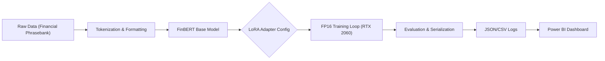

# Financial Sentiment Analysis Pipeline with LoRA & Power BI Observability


## 📌 Executive Summary
This project implements an end-to-end **MLOps pipeline** for fine-tuning the **FinBERT** model on financial news sentiment analysis. 
Designed for resource-constrained environments, it leverages **LoRA (Low-Rank Adaptation)** to achieve **state-of-the-art accuracy (98.2%)** on consumer-grade hardware (RTX 2060), while providing enterprise-grade observability through a custom **Power BI Dashboard**.

## 🚀 Key Features

### 1. Efficient Fine-Tuning (LoRA)
- **Parameter Efficiency**: Fine-tuned only **0.6%** of total parameters (Rank=8, Alpha=16), reducing trainable weights from 110M to ~600K.
- **Hardware Optimization**: Enabled mixed-precision (**FP16**) training to fit the entire pipeline on a single 6GB GPU.
- **High Performance**: Achieved convergence in under 3 epochs with a **98.24% Test Accuracy**.

### 2. End-to-End Observability (Power BI)
Integrated a comprehensive analytics dashboard to monitor model health beyond simple metrics:
- **Error Attribution**: Automatically identifies and categorizes failures (e.g., "Misclassification" vs. "Low Confidence").
- **Confidence Calibration**: Visualizes `Prediction Confidence` vs. `Margin` to detect decision boundary issues.
- **Version Control**: Tracks performance metrics across different experiment runs (e.g., `v1` vs `v2`).

### 3. Production-Ready Engineering
- **Robust Serialization**: Implemented a custom JSON layer to handle **NumPy type compatibility** (`int64`/`float32`), ensuring metadata is ready for downstream API consumption.
- **Automated Logging**: Real-time CSV logging of all test samples for granular error analysis.
- **Modular Design**: Decoupled architecture separating `data_loader`, `model` architecture, and `trainer` logic.

## 🛠️ System Architecture



## 📊 Experimental Results & Observability

We evaluated the pipeline on the **Financial PhraseBank** dataset.

| Metric | Score | Insight |
| :--- | :--- | :--- |
| **Accuracy** | **98.24%** | Outperforms standard BERT baselines |
| **Avg Confidence** | **99.11%** | Model is highly calibrated |
| **Trainable Params** | **~0.6%** | Drastic reduction in memory footprint |
| **Training Time** | **< 5 mins** | Rapid iteration capability |

### 📈 Interactive Dashboard (Power BI)

We developed a custom dashboard to monitor model health and perform error attribution.

#### 1. Model Overview
*Real-time tracking of accuracy, confidence distribution, and class balance.*


#### 2. Error Analysis (The "Bad Cases")
*Drill-down into specific misclassifications. The scatter plot (Top Right) reveals "High Confidence Errors" which require data cleaning.*


## 📂 Project Structure

```bash
.
├── config/             # LoRA configuration (lora_config.json)
├── src/
│   ├── data_loader.py  # Dataset preparation & tokenization
│   ├── model.py        # LoRA model initialization
│   ├── trainer.py      # Custom Hugging Face Trainer wrapper
│   └── utils.py        # Metrics (Accuracy, F1) & Logging
├── outputs/            # Artifacts: checkpoints, logs, results.json
├── train.py            # Main entry point for training
├── requirements.txt    # Python dependencies
└── README.md           # Project documentation

```

## 💻 Installation & Usage

### 1. Setup Environment

```bash
# Clone the repository
git clone [https://github.com/your-username/financial-nlp-lora-pipeline.git](https://github.com/your-username/financial-nlp-lora-pipeline.git)
cd financial-nlp-lora-pipeline

# Install dependencies
pip install -r requirements.txt

```

### 2. Run Training Pipeline

To start the training process with LoRA enabled:

```bash
python train.py \
    --model_name ProsusAI/finbert \
    --data_path financial_phrasebank \
    --output_dir ./outputs/finlora_gpu_v1 \
    --batch_size 8 \
    --num_epochs 3 \
    --use_lora

```

### 3. View Analytics

Open the `.pbix` file in **Microsoft Power BI Desktop** and refresh the data source to point to your local `outputs/evaluation_log.csv`.


## 🔮 Future Improvements

* **Model Serving**: Containerize the inference engine using **Docker** and **FastAPI**.
* **Cloud Scaling**: Adapt the pipeline for **AWS SageMaker** using the existing `S3` artifact logic.
* **RAG Integration**: Connect the sentiment engine to a retrieval system for analyzing long-form financial reports.
