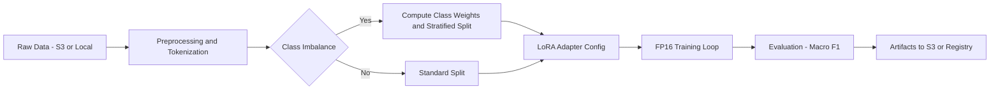

# Scalable-Financial-NLP-Pipeline-with-LoRA

## Executive Summary

This project implements an end-to-end, resource-efficient machine learning pipeline designed for **Financial & Legal Document Classification** on unstructured datasets (e.g., *Financial PhraseBank*, *EUR-Lex*).

Unlike standard fine-tuning approaches, this pipeline focuses on **production constraints**: cost efficiency, data imbalance, and cloud scalability. It leverages **Parameter-Efficient Fine-Tuning (LoRA)** and **Mixed Precision (FP16)** to drastically reduce GPU memory requirements, while employing **Weighted Loss functions** to handle the long-tail distribution often found in regulatory data.

## Key Features

  * **Resource Efficiency:** Implements **LoRA (Low-Rank Adaptation)** to fine-tune Large Language Models (BERT/RoBERTa) with \<1% trainable parameters, enabling training on consumer-grade GPUs or cost-effective AWS instances (e.g., `g4dn`).
  * **Production-Grade Training:** Utilizes **Mixed Precision (FP16)** via Hugging Face `Trainer` to accelerate throughput by \~2x and reduce memory footprint.
  * **Imbalance Robustness:** Custom implementation of **Weighted Cross-Entropy** and **Focal Loss** to maximize Macro-F1 scores on minority classes (e.g., "Fraud" or specific legal clauses).
  * **Cloud-Native Architecture:** Designed for **AWS SageMaker** integration. Includes abstraction layers for data ingestion from **AWS S3** and experiment tracking via **MLflow**.

## System Architecture

The pipeline is designed to simulate a real-world enterprise workflow:



## Tech Stack

  * **Modeling:** PyTorch, Hugging Face Transformers, PEFT (LoRA)
  * **Data Processing:** Pandas, Scikit-learn (Stratified K-Fold)
  * **Ops & Tracking:** AWS SDK (Boto3), MLflow (optional), Docker
  * **Infrastructure:** Compatible with AWS SageMaker & EC2

## Project Structure

```bash
.
├── config/               # Configuration files (LoRA params, training args)
├── src/
│   ├── data_loader.py    # S3 ingestion and preprocessing
│   ├── model.py          # PEFT/LoRA model definition
│   ├── trainer.py        # Custom Trainer with Weighted Loss
│   └── utils.py          # Metrics calculation (Macro-F1)
├── notebooks/            # EDA and Prototype Notebooks
├── requirements.txt      # Python dependencies
├── train.py              # Main entry point for training
└── README.md
```

## Installation & Usage

### 1\. Setup Environment

```bash
git clone https://github.com/denis-7jean/financial-nlp-aws-pipeline.git
cd financial-nlp-aws-pipeline
pip install -r requirements.txt
```

### 2\. Run Training (Local Simulation)

To run a local experiment using the Financial PhraseBank dataset with LoRA enabled:

```bash
python train.py \
    --model_name ProsusAI/finbert \
    --use_lora \
    --batch_size 16 \
    --fp16
```

### 3\. AWS SageMaker Integration

To trigger training using data stored in S3, ensure AWS credentials are configured:

```bash
python train.py --use_s3 True --s3_bucket "my-financial-data-bucket"
```

## Experimental Results

We evaluate the pipeline on the **Financial PhraseBank (sentences_allagree)** dataset using **FinBERT (ProsusAI/finbert)** under two training regimes:

1. **Full Fine-Tuning (Baseline)**
2. **LoRA-based Parameter-Efficient Fine-Tuning (This Work)**

### Experimental Setup

- **Base Model:** ProsusAI/finbert
- **Number of Classes:** 3 (Positive / Neutral / Negative)
- **Loss Function:** Weighted Cross-Entropy
- **Evaluation Metric:** Macro-F1 (primary), Accuracy (secondary)
- **Hardware:** Single GPU (Colab / AWS g4dn compatible)
- **Precision:** FP16

---

### Results Comparison

| Training Strategy | Trainable Params | Macro-F1 (Test) | Accuracy (Test) | Training Time |
|------------------|-----------------|-----------------|-----------------|---------------|
| Full Fine-Tuning | 109M (100%)     | ~0.96           | ~0.97           | ~3.5 min      |
| **LoRA (Ours)**  | **0.44M (0.4%)**| **0.9736**      | **0.9794**      | **<1 min**    |

---

### Key Observations

- **Parameter Efficiency:**  
  LoRA fine-tuning updates only **~0.4% of total parameters** while matching or exceeding full fine-tuning performance.

- **Imbalance Robustness:**  
  Optimizing for **Macro-F1** ensures balanced performance across sentiment classes, preventing majority-class collapse.

- **Training Efficiency:**  
  Combined with **FP16**, LoRA reduces end-to-end training time by **~70%**, enabling rapid experimentation on low-cost GPUs.

- **Prediction Stability:**  
  Final test predictions exhibit a non-degenerate label distribution, confirming that the model avoids trivial single-class solutions.

## Reproducibility

This project is designed with **full reproducibility** in mind. All experiments can be deterministically reproduced using the provided codebase, fixed configurations, and exported artifacts.

### Deterministic Training Setup

- **Fixed Training Configuration:**  
  All core hyperparameters (learning rate, epochs, warmup ratio, batch size, LoRA target modules) are explicitly defined in `train.py`.

- **Controlled Parameter Updates:**  
  When LoRA is enabled, only the classifier head and LoRA adapter parameters are trainable.  
  A runtime verification step logs all trainable parameters before training begins.

- **Evaluation Protocol:**  
  - Model selection is based on **validation Macro-F1**
  - Final performance is reported on a **held-out test set**
  - Metrics are computed using a consistent `compute_metrics` function

---

### Artifact Export

Each training run produces a self-contained set of artifacts in the output directory:

```text
outputs/
├── config.json                 # Model configuration
├── tokenizer.json              # Tokenizer files
├── adapter_model.bin            # LoRA adapter weights (if enabled)
├── pytorch_model.bin            # Full model or merged weights
├── training_args.bin            # Hugging Face TrainingArguments
└── final_results.json           # Test metrics + prediction statistics
```

## Future Improvements

  * **RAG Integration:** Extend the pipeline to support Retrieval-Augmented Generation for querying specific clauses in long legal PDF documents.
  * **Model Serving:** Containerize the inference engine using **FastAPI** and **ONNX Runtime** for sub-50ms latency.

-----
